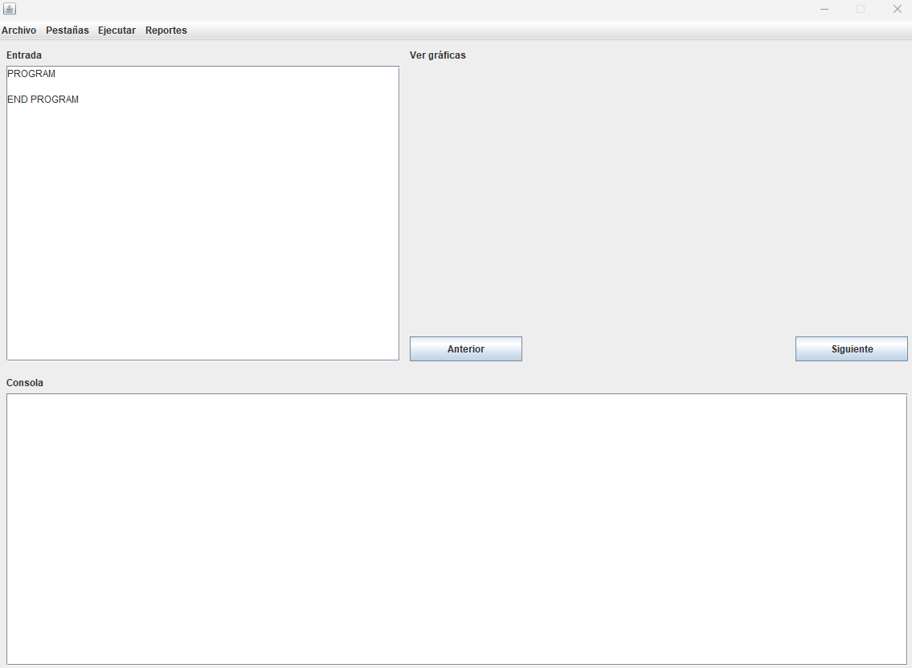
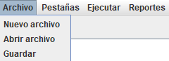
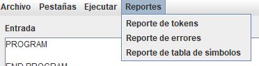
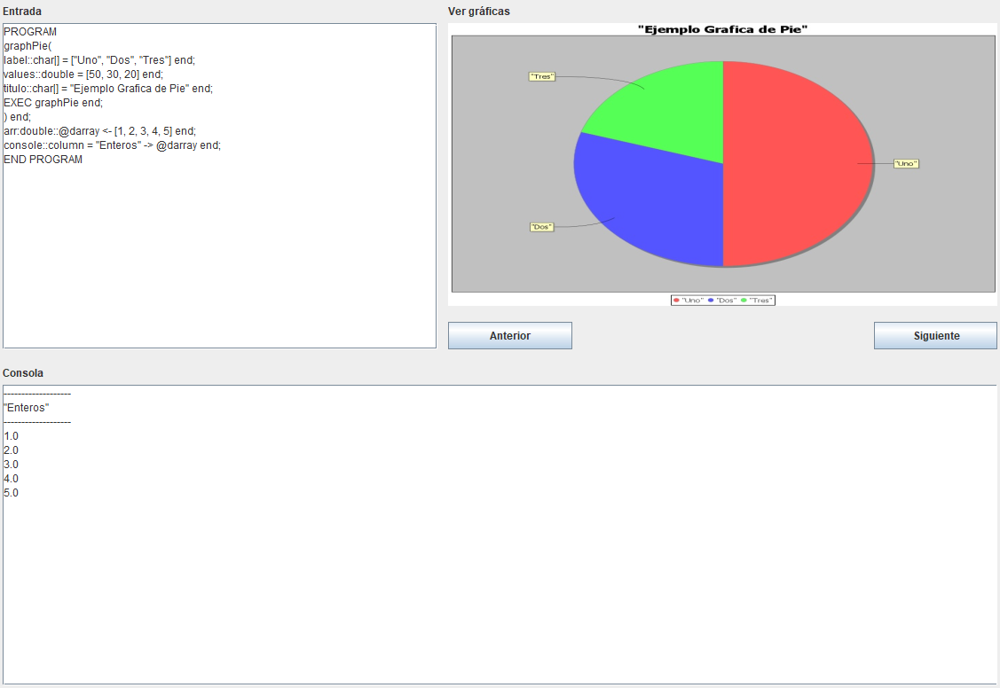
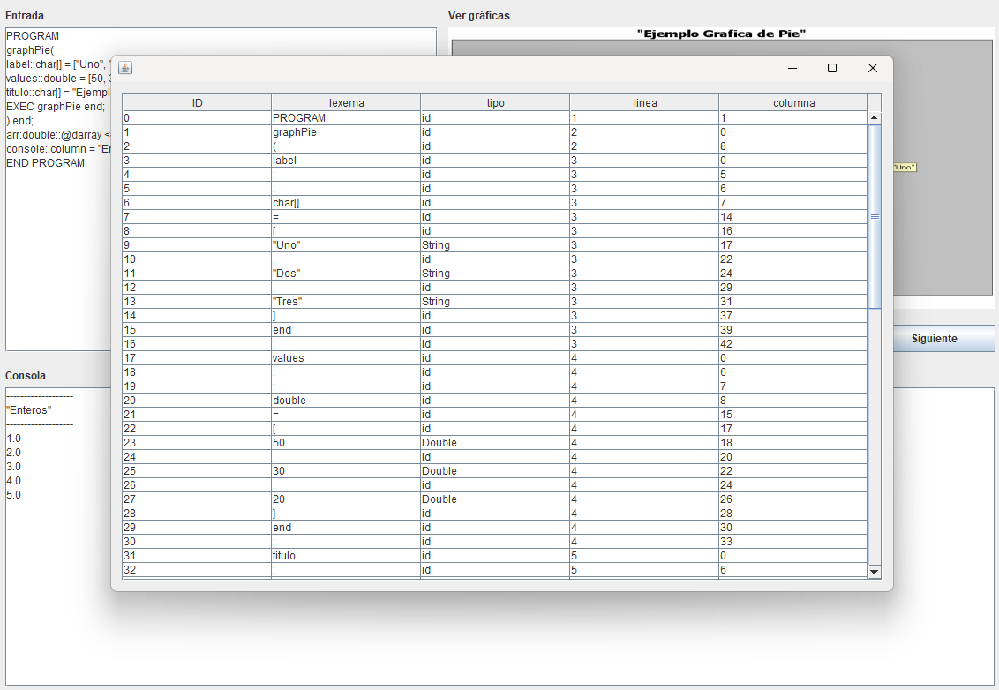
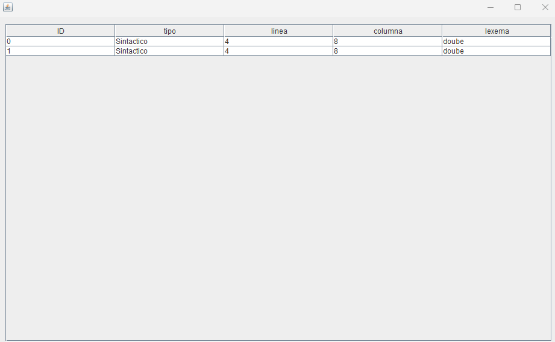

# Manual Usuario

## Editor
- Entrada
En esta parte se debe escribir y modificar el código a ejecutar.
- Consola
En esta parte se mostrarán los resultados del codigo escrito en Entrada.
- Ver gráficas
En esta parte se podran ver las gráficas que se hayan generado con el código y se podra navegar entre ellas con los botones de anterior y siguiente.

En la barra de arriba tendrémos las siguientes opciones:
- Archivo
Este apartado contará con 3 opciones: 
Nuevo archivo: para guardar el codigo de la entrada.
Abrir archivo: para cargar un archivo a la entrada.
Guardar: para guardar los cambios que se le hayan hecho en el archivo cargado a la entrada.

- Reportes
Este apartado contará con 3 opciones:
Reporte de tokens: nos mostrará una tabla emergente con los tokens guardados en la ejecución de la entrada.
Reporte de errores: en caso de haber, nos mostrará una tabla con los errores léxicos y sintácticos en la ejecución de la entrada.
Reporte de tabla de simbolos: nos mostrará las variables y sus valores en una tabla emergente.

- ejecutar
se ejecutará la entrada y se mostraran los resultados en la consola y / o graficas.

- Reporte de tokens

- reporte de errores
